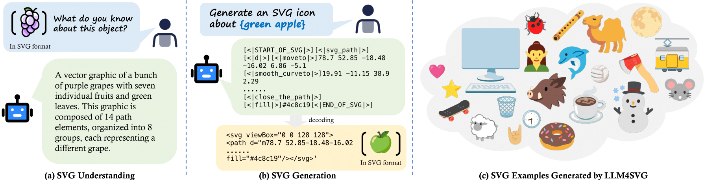

# Empowering LLMs to Understand and Generate Complex Vector Graphics

[](https://ximinng.github.io/LLM4SVGProject/)

Official implementation for "Empowering LLMs to Understand and Generate Complex Vector Graphics"

## 🚀 Stay Tuned: Code Release Coming Soon

<figure style="margin-bottom: 20px;">
  
  <figcaption style="text-align: center;">
    Our LLM4SVG can understand and generate vector graphics from textual description.
Our LLM4SVG is designed to:
(a) Understand the semantics of SVG (Scalable Vector Graphics) source code and directly extract the meanings conveyed by vector images;
(b) Generate corresponding structured SVG representations from textual prompts and decode them into SVG source code that accurately reflects the described content.
(c) illustrates some SVG examples generated by our method.
  </figcaption>
</figure>

## :paperclip: Citation

If you use this code for your research, please cite the following work:

```
@article{xing2024llm4svg,
  title={Empowering LLMs to Understand and Generate Complex Vector Graphics},
  author={Xing, Ximing and Hu, juncheng and Zhang, Liang and Guotao, Jing and Xu, Dong and Yu, Qian},
  journal={arXiv preprint},
  year={2024}
}
```

## :copyright: Licence

This work is licensed under a MIT License.